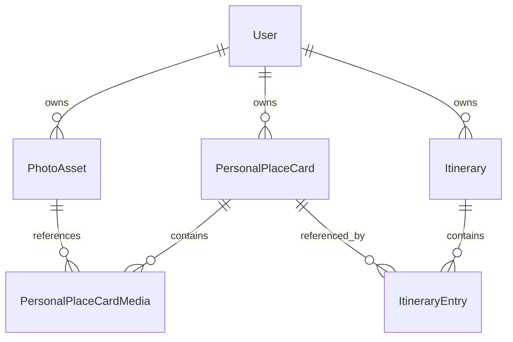

# Stage 2 — Personal Place Cards

## Status

Approved architecture

Source audit: `tripideas-api` at
`f6737de192c855a89081a83d6d7cba36456d9227`

## 1. Purpose and product definition

Stage 2 introduces Personal Place Cards as the first constrained, structured
user-content object in the Personal Content Platform.

A Personal Place Card is designed to be created for, added to, used in and
viewed through the traveller's Trip Ideas. It does not require a separate
primary library or browsing product after creation.

A Personal Place Card:

- is owned and controlled by one user;
- is one canonical record;
- may be referenced from any number of that user's Trip Ideas;
- is edited once, with changes reflected everywhere it is referenced;
- behaves within a Trip Idea similarly to an editorial TripIdeas place;
- can appear in Trip Idea lists and maps;
- can later participate in itinerary planning and sharing; and
- remains independent of any individual Notebook or Trip Idea.

This document is the detailed architecture reference for Stage 2. The durable
decisions are also summarized in:

- [Personal Place Card domain model](../../decisions/personal-place-card-domain-model.md)
- [Polymorphic Trip Idea entries](../../decisions/polymorphic-trip-idea-entries.md)

## 2. Relationship to Stage 1 Notebook

[Stage 1 Notebook](stage-1-notebook-rfc.md) is a flexible capture and working
environment. A Personal Place Card is a structured final-content object with a
constrained presentation contract.

Notebook is not the parent of a Personal Place Card. For the initial design:

- selected Notebook text may be copied into a Place Card;
- eligible Notebook PhotoAssets may be referenced without duplicating stored
  files;
- provenance records relevant Notebook origins;
- the resulting card is independent of live Notebook rendering; and
- later AI tools may help transform Notebook material into compliant Place
  Card text, but AI transformation is not part of Stage 2.

The copied text and referenced assets become components of the canonical card.
Subsequent Notebook edits do not silently alter the Place Card.

## 3. Scope and non-goals

### In scope

- a canonical, private, user-owned Personal Place Card;
- draft creation and editing;
- explicit readiness evaluation before Trip Idea use;
- constrained title and plain-text body;
- one main photo and up to ten ordered body photos;
- confirmed coordinates;
- provenance and rights metadata foundations;
- reuse across multiple Trip Ideas;
- discriminated integration with editorial places in Trip Idea entries;
- owner-scoped lifecycle, authorization, versioning and deletion semantics.

### Non-goals

- a public user-content platform;
- a Place Card social feed;
- a standalone Place Card browsing product;
- publication or editorial submission;
- licensing acceptance or moderation workflows;
- AI writing;
- rich-text editing;
- arbitrary content blocks or embedded-media layouts;
- route storage or route geometry;
- authoritative automatic geocoding;
- mobile, web or CMS implementation in this architecture task.

## 4. Existing-system context

The code-grounded API audit established:

- the persisted Trip Idea model is currently named `Itinerary`;
- `ItineraryEntry` represents a Trip Idea item and currently stores an opaque
  editorial `placeId`;
- Trip Idea ordering currently lives in the client-authoritative
  `entryOrder`;
- editorial place content is not owned or resolved by the API;
- Notebook already establishes owner scoping, optimistic concurrency,
  idempotent client requests, soft deletion and transactional ordering;
- `PhotoAsset` is a canonical, independently owned, reusable private asset;
- PhotoAsset already carries upload state, dimensions, private coordinates and
  provider-neutral storage identity; and
- current account deletion and parts of the Trip Idea entry boundary require
  repair before the model is extended.

There is no existing generic Place record in the API that can represent both
editorial and personal content without losing important ownership and source
distinctions.

## 5. Approved domain model



### PersonalPlaceCard

The canonical entity should contain:

- a stable typed ID;
- `ownerUserId`, referencing the authenticated internal user;
- a monotonic version for optimistic concurrency;
- lifecycle state;
- nullable draft title and body;
- card-level latitude and longitude;
- location source and confirmation information;
- optional, non-authoritative location display text;
- text provenance and rights metadata; and
- created, updated and deletion lifecycle timestamps.

The lifecycle must support incomplete drafts and active, Trip-Idea-ready cards.
Soft deletion or an equivalent staged lifecycle must remain consistent with the
existing user-content platform.

One card is shared canonically by all of its Trip Idea entries. Its complete
content is never copied into each Trip Idea.

### PersonalPlaceCardMedia

Card media uses an ordered association to an existing `PhotoAsset`. The
association owns:

- card identity;
- asset identity;
- role: `MAIN` or `BODY`;
- body-photo position;
- active/deleted relationship state where required; and
- component-level source context where required.

The model must enforce:

- exactly one active main photo for a Trip-Idea-valid card;
- no more than ten active body photos;
- stable, explicit body-photo ordering;
- same-owner card and asset relationships;
- asset eligibility at attachment and readiness evaluation; and
- one stored object reused by multiple eligible contexts rather than copied.

Role and order belong to the association, not to `PhotoAsset`.

### ItineraryEntry

The existing Trip Idea entry becomes an explicit discriminated relationship
targeting exactly one of:

- an editorial TripIdeas place; or
- a Personal Place Card.

The two references are mutually exclusive. The entry continues to own:

- the containing Trip Idea;
- ordering participation;
- future itinerary metadata; and
- future per-Trip-Idea annotations where required.

The Personal Place Card owns the shared title, body, media and confirmed
location.

## 6. Content and media model

The initial content model is deliberately constrained:

1. title;
2. plain-text body;
3. one main image; and
4. an ordered body-photo group after the body.

The body is not a rich-text document and does not use arbitrary Content Blocks.
The body-photo group is a constrained presentation of ordered media
associations, not a Notebook Page or `UserContentItem`.

This keeps the first version aligned with existing application typography and
display conventions while avoiding a new editor and rendering system.

Eligible Notebook photos reuse the same owner `PhotoAsset`. Removing a Notebook
block or a Place Card media relationship does not, by itself, delete the
underlying asset.

## 7. Readiness and validation

Validity has two levels.

### Draft-valid

A card may be created and saved while incomplete. A draft requires only:

- an authenticated owner;
- a stable ID;
- valid lifecycle and version information; and
- valid values for any fields that are supplied.

An unattached draft may omit its title, body, main photo or confirmed location.

### Trip-Idea-valid

Before first attachment to a Trip Idea, the aggregate must have:

- a trimmed title from 1 to 80 characters;
- a trimmed, non-empty plain-text body no longer than 8,000 characters;
- exactly one eligible main PhotoAsset;
- no more than ten eligible ordered body PhotoAssets;
- a confirmed latitude/longitude pair within valid ranges;
- matching ownership for every asset; and
- no deletion, upload, processing or lifecycle condition that makes the card
  unusable.

The API enforces characters rather than word count. The 8,000-character body
ceiling is the approved practical approximation of the approximately
1,200-word product target.

Readiness must be explicit in API responses and evaluated from the current
aggregate. A lifecycle label alone cannot make an unavailable asset valid.

### Attached-card edit rule

A card attached to one or more Trip Ideas must not be editable into a
Trip-Idea-invalid state. The API rejects an update that would invalidate an
attached card.

This protects:

- Trip Idea content integrity;
- map rendering;
- itinerary compatibility;
- later sharing behaviour; and
- predictable downstream API contracts.

An unattached card may remain or return to an incomplete draft state.

## 8. Trip Idea integration

Attachment must transactionally verify:

- the caller owns the active Trip Idea;
- the caller owns the active Personal Place Card;
- the card is currently Trip-Idea-valid;
- the card is not already attached to that Trip Idea;
- the requested order is valid; and
- entry creation and order changes commit together.

Stable client request IDs should make retried attachment operations idempotent.

Trip Idea responses should expose a discriminated item union rather than
pretending editorial and personal places are the same domain record. Clients
may render common title, photo and map fields while retaining the item's source
type.

Conceptually:

```ts
type TripIdeaItem =
  | {
      id: string;
      type: "editorial_place";
      editorialPlaceId: string;
      note: string | null;
    }
  | {
      id: string;
      type: "personal_place_card";
      personalPlaceCard: {
        id: string;
        version: number;
        title: string;
        body: string;
        location: { latitude: number; longitude: number };
        mainPhotoAssetId: string;
        bodyPhotoAssetIds: string[];
      };
      note: string | null;
    };
```

Editorial content remains externally resolved. The API must not create
synthetic editorial database records merely to force both variants into one
persistence shape.

The initial implementation retains existing `entryOrder` behaviour and keeps
ordering client-authoritative. The API must enforce ownership and validate
input. A broader ordering redesign is deferred unless implementation evidence
shows it is required.

## 9. Location behaviour

A confirmed card-level map location is required before Trip Idea attachment.
Coordinates use the existing `{ latitude, longitude }` order and valid ranges.

The future creation experience may:

- suggest coordinates from photo metadata;
- require user confirmation or adjustment;
- allow direct map placement; and
- use address lookup as a supplementary aid.

PhotoAsset coordinates are suggestion input, not automatically confirmed card
coordinates. A postal address is not mandatory or authoritative. Remote, rural
and unnamed locations must remain fully supported.

Route geometry is deferred.

## 10. Ownership, provenance and rights

The architecture distinguishes four concepts:

1. Place Card ownership;
2. content-component provenance;
3. ownership or licence status; and
4. publication eligibility.

A user controls their private Place Card without necessarily owning every
component included in it.

The initial model should preserve at least:

- source type, such as user-created, Notebook reuse, TripIdeas-derived,
  external import or unknown;
- rights basis, such as user-owned, licensed, TripIdeas-owned or unknown; and
- publication assessment, such as unassessed, potentially eligible or not
  eligible.

Text provenance belongs on the card. Intrinsic media provenance and rights
belong on `PhotoAsset`; association-level context may record how that asset
entered the card.

`POTENTIALLY_ELIGIBLE` is not consent, a licence grant or editorial approval.
TripIdeas gains no publication or commercial-use rights merely because content
was:

- uploaded;
- placed in a Notebook;
- used in a Personal Place Card; or
- added to a Trip Idea.

Publication permission must never be inferred. Publication, moderation and
licensing workflows remain outside Stage 2.

## 11. Lifecycle and deletion

The following semantics are approved:

- removing a card from one Trip Idea removes only that entry;
- the canonical card and its assets remain;
- other Trip Ideas referencing the same card remain unchanged;
- removing a media relationship retains its PhotoAsset;
- deleting or revoking an asset must not silently leave an attached card
  invalid; and
- account deletion must invalidate access immediately and coordinate
  relational and stored-object cleanup under the Stage 1 lifecycle policy.

Deletion of a canonical card must be rejected while it has one or more active
Trip Idea attachments. The API must return the number of active attachments so
the user can understand why deletion is unavailable. The user must remove the
card from every Trip Idea before deleting the canonical card.

Deletion must never detach usages implicitly. This keeps removal from a Trip
Idea an explicit action and prevents an apparently local card deletion from
silently changing several Trip Ideas.

Physical asset deletion must initially be rejected while an active card-media
relationship exists.

## 12. Authentication and authorization boundaries

All Personal Place Card operations are authenticated and owner-scoped.
Ownership derives from the verified identity's internal `User.id`.

The API must:

- return indistinguishable not-found behaviour for absent and foreign owner
  records where appropriate;
- use the canonical route or trusted database record as the parent identity;
- reject or ignore conflicting parent identifiers in request bodies;
- verify card, Trip Idea and PhotoAsset ownership within the mutation
  transaction;
- use expected-version checks for canonical edits; and
- prevent client input from assigning ownership.

One canonical card may be edited from several contexts, so optimistic
concurrency is required rather than silent last-write-wins behaviour.

## 13. Cross-repository responsibilities

### `tripideas-api`

- schema, migrations and owner-scoped persistence;
- concurrency and request idempotency;
- readiness evaluation;
- media eligibility, roles, count and ordering;
- attachment and removal lifecycle;
- discriminated Trip Idea DTOs;
- account-deletion integration;
- local migration and service tests.

### `tripideas-mobile` — separately authorized later

- creation and editing experience;
- Notebook selection and explicit text copy;
- asset reuse;
- photo-location suggestion and confirmation;
- mixed editorial/personal list and map rendering;
- compatibility with existing `entryOrder`.

### `tripideas-web` and `tripideas-cms` — separately authorized if required

- editorial place resolution and presentation adapters;
- current editorial coordinate and media contracts;
- shared/public rendering only under a separately approved scope.

Sanity remains the editorial system of record. It must not own private Personal
Place Cards.

## 14. Prerequisite fixes

The following work is mandatory before or alongside extension of Trip Idea
entry types:

1. repair the route/body `itineraryId` ownership boundary so the authorized
   route or trusted record is the sole parent identity;
2. ensure entry queries exclude entries belonging to deleted Trip Ideas; and
3. complete account deletion for Trip Ideas, Trip Idea entries, Personal Place
   Cards, Notebook content, PhotoAssets and stored objects.

These are architectural prerequisites because extending the existing entry
model without them would widen current ownership and lifecycle weaknesses.

## 15. Staged implementation plan

### Milestone 2.0 — Existing boundary fixes

- repair itinerary ownership boundaries;
- filter entries for deleted Trip Ideas;
- complete account deletion;
- add regression and lifecycle tests.

### Milestone 2.1 — Personal Place Card foundation

- add the canonical entity and additive migration;
- add ordered media relationships;
- implement lifecycle and owner scoping;
- implement readiness evaluation;
- add owner CRUD;
- verify optimistic concurrency and idempotency;
- add tests.

No Trip Idea attachment is included in this milestone.

### Milestone 2.2 — Trip Idea entry integration

- add the explicit entry discriminator and nullable personal-card reference;
- backfill existing entries as editorial;
- enforce mutually exclusive targets;
- implement attachment and removal;
- retain and validate ordering;
- expose discriminated responses;
- add ownership, readiness and compatibility tests.

### Milestone 2.3 — Mobile creation and editing

This is a separate repository and requires separate authorization.

### Milestone 2.4 — Notebook-assisted creation

- select Notebook content;
- copy text into a card;
- reuse eligible PhotoAssets;
- record provenance;
- later consider AI-assisted transformation.

This remains separate future scope.

### Milestone 2.5 — Sharing and itinerary integration

Defer sharing and deeper itinerary behaviour until the private canonical model
is stable.

Each milestone should be small, reviewable and independently verified.

## 16. Risks and deferred decisions

### Deferred pending implementation evidence

- whether `entryOrder` needs redesign after a separately authorized client
  audit;
- how later processed-asset states alter the centralized eligibility policy;
- richer body formats and arbitrary media layout;
- editorial map-resolution integration;
- complete asset purge-worker behaviour;
- public sharing, publication and itinerary scheduling.

### Known risks

- current route/body itinerary identity divergence;
- deleted Trip Ideas leaking into current entry searches;
- incomplete account deletion;
- incomplete asset deletion and purge execution;
- external editorial-place resolution;
- migration compatibility for existing opaque editorial IDs and clients.

The first three are explicit prerequisites, not reasons to weaken the approved
model.

## 17. Source and references

Primary implementation evidence:

- repository: `tripideas-api`;
- branch audited: `feature/notebook-user-content-foundation`;
- audited SHA: `f6737de192c855a89081a83d6d7cba36456d9227`;
- report:
  `audit/personal-place-cards/stage-2-place-card-foundation-audit.md`.

Architecture references:

- [Personal Content Platform](../personal-content-platform.md)
- [Stage 1 Notebook RFC](stage-1-notebook-rfc.md)
- [Personal Place Card domain model decision](../../decisions/personal-place-card-domain-model.md)
- [Polymorphic Trip Idea entries decision](../../decisions/polymorphic-trip-idea-entries.md)
